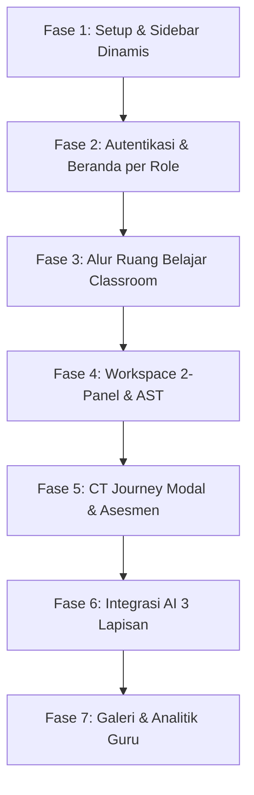

# Rencana Implementasi Lengkap — WebCraft 2.0 Overhaul

Rencana ini merinci proses restrukturisasi penuh aplikasi WebCraft menjadi versi 2.0. Seluruh komponen visual dan fungsional diatur ulang untuk menghadirkan alur belajar yang intuitif (seperti Google Classroom) dan menonjolkan integrasi AI di setiap tingkat pengguna tanpa menggunakan emoji unicode (hanya menggunakan Tabler Icons outline).

---

## User Review Required

> [!IMPORTANT]
> - **Penghapusan Seluruh Emoji**: Semua emoji teks/unicode (seperti 🚀, 🤖, ✨) akan dihapus sepenuhnya dari UI dan digantikan dengan ikon outline profesional menggunakan **Tabler Icons** (`ti ti-*`).
> - **Navbar Dinamis & Melayang (Sidebar)**: Menggunakan desain "Dynamic Round Card" di sisi kiri layar dengan transisi lebar halus, sudut yang sangat membulat (rounded-3xl), serta bayangan neo-brutalism yang tebal.
> - **Workspace 2 Panel**: Rantai pengerjaan visual disederhanakan menjadi 2 panel utama:
>   1. **Panel Kiri (Palet Blok)**: Daftar blok HTML yang bisa di-drag.
>   2. **Panel Kanan (Kanvas & Switch Card)**: Kanvas visual tempat merakit blok dengan tombol-tombol toggle bergaya tab card di bagian atas untuk beralih secara langsung ke mode **Live Preview** dan **Live Code HTML**.

---

## Urutan Pengerjaan & Komponen Detail



---

## Rencana Komponen & Halaman (Frontend)

### 1. Struktur Navigasi & Sidebar Melayang (`Sidebar.jsx`)
- **Desain**: Sidebar melayang melengkung di sisi kiri dengan warna latar abu gelap (`bg-[#0F172A]`), sudut membulat lebar (`rounded-r-[32px]`), border hitam tebal, dan bayangan tebal khas neo-brutalism.
- **Interaktivitas**: Lebar menciut secara default (64px) hanya menampilkan ikon, dan melebar secara dinamis (220px) ketika disorot (`onMouseEnter`) dengan efek transisi CSS `transition-all duration-300 ease-in-out`.
- **Menu per Peran (Role)**:
  - **Guest (3 Menu)**:
    - Beranda (`ti ti-home`)
    - Ruang Belajar (`ti ti-school` - mengarah ke login gate)
    - Masuk Kelas (`ti ti-login`)
  - **Siswa (5 Menu)**:
    - Beranda (`ti ti-home` - statistik, radar CT, dan jalan pintas tugas terakhir)
    - Ruang Belajar (`ti ti-school` - daftar room kelas yang diikuti + input kode kelas)
    - Galeri Karya (`ti ti-photo-heart` - galeri publik dengan tag kelas)
    - Perkembanganku (`ti ti-chart-radar` - peta CT radar chart & rekomendasi AI)
    - Tugasku (`ti ti-checklist` - daftar tugas aktif yang belum dikerjakan dari semua room)
  - **Guru (5 Menu)**:
    - Beranda (`ti ti-home` - statistik room, pengumpulan tugas pending, flagging siswa butuh perhatian)
    - Ruang Belajar (`ti ti-school` - pembuatan room baru, pengelolaan pertemuan, rubrik, soal pre/post test)
    - Galeri Karya (`ti ti-photo-share` - persetujuan publikasi karya siswa & review umpan balik)
    - Penilaian & Analitik (`ti ti-chart-bar` - tabel nilai total, diagram batang sebaran nilai, heatmap eror)
    - Asisten AI (`ti ti-sparkles` - asisten AI terpusat untuk guru)

### 2. Alur Halaman Ruang Belajar (Google Classroom Flow)
- **Halaman RuangBelajar (`/ruang-belajar`)**:
  - *Siswa*: Kotak input kode kelas 6-digit (WC-XXXX) untuk bergabung. Menampilkan daftar kartu room kelas yang diikuti.
  - *Guru*: Tombol tambah room baru, menampilkan kode unik room, dan tombol kelola.
- **Halaman RoomDetail (`/ruang-belajar/:roomId`)**:
  - Menampilkan deskripsi kelas dan daftar tugas berurutan: Pre-test $\rightarrow$ Pertemuan 1..N $\rightarrow$ Project $\rightarrow$ Post-test.
  - Setiap tugas memiliki lencana status: `Belum Dibuka`, `Siap Dikerjakan`, `Menunggu Nilai`, `Selesai`.
  - Di bagian bawah terdapat tab "Galeri Kelas" (menampilkan karya khusus siswa dari kelas tersebut).
- **Halaman TugasDetail (`/ruang-belajar/:roomId/tugas/:tugasId`)**:
  - Menyediakan kartu visual bermodel neo-brutalism yang memuat CBL Context (Big Idea & Essential Question), materi pendukung (teks & video), serta tombol besar "Mulai Kerjakan".

### 3. Workspace 2-Panel & CT Journey (`Workspace.jsx`)
- **Modal CT Journey**: Terbuka saat mengklik "Mulai Kerjakan" pada tugas yang belum diselesaikan. Mengharuskan siswa melalui 4 langkah berpikir komputasional terpandu AI:
  1. *Dekomposisi*: Mengetik bagian-bagian web menggunakan input chip interaktif.
  2. *Abstraksi*: Memilih 3 chip terpenting yang menjadi prioritas pengerjaan.
  3. *Pola*: Mengelompokkan chip ke dalam kategori/grup buatan sendiri.
  4. *Algoritma*: Mengurutkan langkah-langkah kerja menggunakan daftar drag-and-drop.
- **Workspace Layout**:
  - *Panel Kiri (Palette)*: Daftar kategori elemen HTML (Kontainer, Judul, Teks, CSS) dengan ikon-ikon Tabler.
  - *Panel Kanan (Canvas & Switch Card)*: Area drop utama dengan switch tab minimalis di bagian atas:
    - Tab Kanvas (`ti ti-layout-kanban`): Area penyusunan blok visual.
    - Tab Preview (`ti ti-eye`): Pratinjau live menggunakan sandboxed iframe.
    - Tab HTML (`ti ti-code`): Tampilan kode teks HTML yang ter-generate secara real-time.
  - *Footer Bar*: Informasi jumlah attempt (percobaan), tombol "Cek Logika" (mengevaluasi aturan AST), dan tombol "Kirim Hasil Misi".

### 4. Integrasi AI (3-Layer) & Cara Menonjolkannya di UI
- **Pemberian Identitas AI**: Setiap kali data/teks dihasilkan oleh AI, UI akan menampilkan badge kecil ungu bercahaya bertuliskan `ti ti-sparkles AI` dan border pembungkus berwarna indigo lembut (`border-indigo-200 bg-indigo-50/50`).
- **Indikator Loading AI**: Menampilkan animasi loading dots 3 titik berwarna ungu dengan label "AI sedang menganalisis rencana kerjamu..." saat backend memproses model.
- **Detail 3 Lapisan AI**:
  1. *AI Tutor Siswa*: Chat bubble melayang di pojok kanan bawah workspace. Aktif otomatis setelah 4 kali percobaan gagal (attempt >= 4). Menggunakan metode Socratic (tanya balik tanpa memberi jawaban kode langsung).
  2. *AI Analitik CT*: Menganalisis refleksi mandiri pasca-coding dan data pengerjaan untuk menghasilkan radar chart 4 pilar CT dan narasi personal di halaman `Perkembanganku.jsx`.
  3. *AI Asisten Guru*:
     - *Insight Kelas*: Analisis heatmap eror tersering dan flagging siswa butuh perhatian.
     - *Generator Konten*: Rekomendasi materi, deskripsi tantangan, dan aturan validasi AST otomatis.
     - *Asisten Penilaian*: Menganalisis AST tugas project siswa dan merekomendasikan saran skor awal berdasarkan rubrik yang ditentukan guru.
     - *Rekomendasi Soal*: Membuat draf soal pre/post test secara otomatis berdasarkan topik materi kelas.

---

## Database Schema & Backend Routers

Semua schema relasi PostgreSQL/SQLite akan diperiksa dan disesuaikan untuk mendukung data dinamis ini:
- `users`: Kolom role (`siswa`/`guru`/`admin`), email, password_hash, dan nama lengkap.
- `rooms` & `room_members`: Menghubungkan siswa dengan kode kelas unik 6-digit.
- `pertemuan` & `tasks`: Mendukung tipe pertemuan (`pretest`, `pertemuan`, `project`, `posttest`), materi pelajaran, dan rubrik JSON.
- `ct_journey_sessions`: Menyimpan rencana kerja 4 langkah siswa.
- `learning_submissions` & `project_submissions`: Menyimpan snapshot pengerjaan, skor proses, komentar guru, dan status galeri.

### API Endpoint Utama yang Disediakan/Diperbarui:
- `POST /api/auth/register` & `POST /api/auth/login`
- `GET /api/rooms` & `POST /api/rooms/join`
- `GET /api/rooms/:roomId/tugas` & `GET /api/pertemuan/:id`
- `POST /api/ct-journey/start` & `POST /api/ct-journey/step`
- `POST /api/submissions/learning` & `POST /api/submissions/project`
- `POST /api/ai/tutor` & `POST /api/ai/class-insights` & `POST /api/ai/suggest-score`

---

## Rencana Verifikasi (Verification Plan)

### Automated Verification
- Melakukan linting dan build bundle menggunakan Vite:
  ```bash
  npm run build
  ```
- Menjalankan unit test API backend jika tersedia, atau menguji reload otomatis server FastAPI.

### Manual Verification
- **Pengujian Login & Sidebar**: Login sebagai Siswa Demo dan Guru Demo secara bergantian. Verifikasi sidebar menampilkan menu yang sesuai perannya dan menciut/melebar dengan transisi yang mulus.
- **Pengujian Alur Kelas**: Menggunakan akun Siswa, join kelas `IPA7A1`, buka tugas `Struktur Bumi`, lalui proses CT Journey, selesaikan workspace, periksa logika, isi refleksi, dan pastikan data tersimpan di backend.
- **Pengujian Tanpa Emoji**: Memeriksa seluruh halaman dan memastikan tidak ada emoji teks/unicode yang tertinggal di UI.
